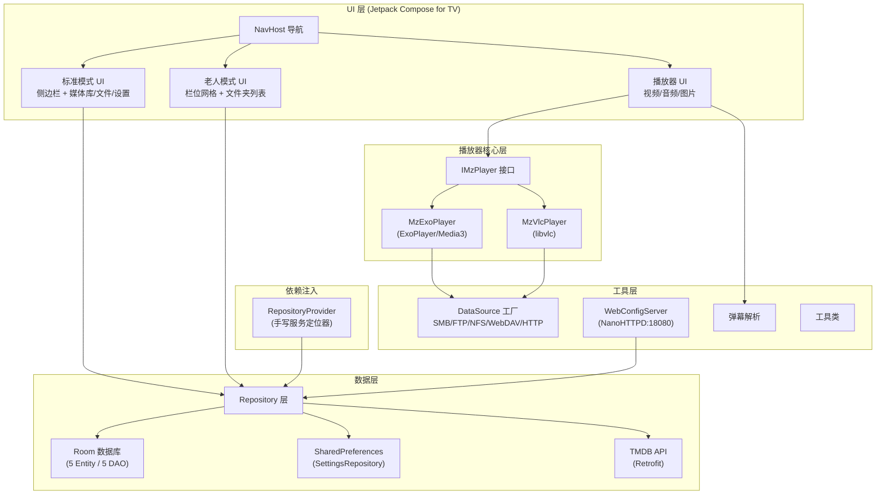
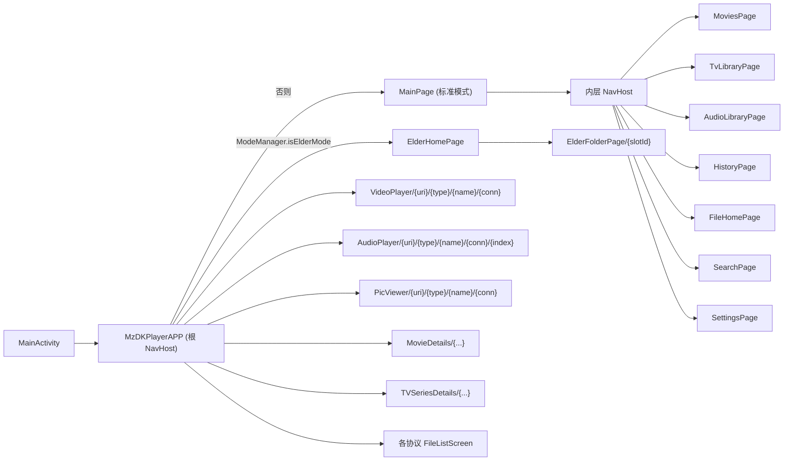

# 02 - 技术架构

## 2.1 系统架构总览



## 2.2 分层架构说明

项目采用经典的四层架构，但 DI 层用手写服务定位器代替了框架：

### 表现层（UI）

- **框架**：Jetpack Compose for TV + TV Material 3
- **导航**：Navigation Compose，单 Activity 多 Composable
- **入口**：[MainActivity.kt](../app/src/main/java/org/mz/mzdkplayer/MainActivity.kt) → [MzDKPlayerAPP.kt](../app/src/main/java/org/mz/mzdkplayer/ui/MzDKPlayerAPP.kt)
- **特点**：
  - 标准模式使用 `ModalNavigationDrawer` 侧边栏 + 内层 `NavHost`
  - 老人模式使用独立 `NavHost`，与标准模式完全隔离
  - 自定义 DPI 适配（`attachBaseContext` 中将屏幕宽度归一化到 960dp）

### 播放器核心层

- **接口抽象**：[IMzPlayer](../app/src/main/java/org/mz/mzdkplayer/player/core/IMzPlayer.kt) 定义播放/暂停/seek/轨道切换/字幕等能力
- **双实现**：
  - [MzExoPlayer](../app/src/main/java/org/mz/mzdkplayer/player/exo/MzExoPlayer.kt) - 默认引擎，基于 Media3/ExoPlayer
  - [MzVlcPlayer](../app/src/main/java/org/mz/mzdkplayer/player/vlc/MzVlcPlayer.kt) - 备用引擎，基于 libvlc，处理 ISO/蓝光原盘
- **引擎选择**：在 [MzDKPlayerAPP.kt:408](../app/src/main/java/org/mz/mzdkplayer/ui/MzDKPlayerAPP.kt#L408) 单点判断
  ```kotlin
  val forceVlcByExtension = extension in listOf("m2ts", "iso", "m2t", "mts", "ts")
  val shouldUseVlc = forceVlcByExtension || (settingsState.defaultPlayer == "vlc")
  ```

### 数据层

- **本地存储**：Room 数据库（版本 9），5 个 Entity
- **远程 API**：Retrofit + TMDB REST API
- **配置存储**：SharedPreferences（`SettingsRepository` 单例）
- **Repository 模式**：每个数据域一个 Repository，封装数据来源

### 工具层

- **DataSource 工厂**：各协议的 ExoPlayer `DataSource.Factory` 实现
- **HTTP 服务**：NanoHTTPD 内嵌服务器（Web 配置 + 远程输入）
- **弹幕解析**：XML 解析为 `DanmakuResponse`

## 2.3 技术栈选型

### 核心依赖

| 类别 | 技术 | 版本 | 选型理由 |
|------|------|------|---------|
| 语言 | Kotlin | 2.4.0 | Android 官方首选语言 |
| UI 框架 | Jetpack Compose for TV | BOM 2026.05 | TV 专用组件库，声明式 UI |
| TV 组件 | TV Material 3 | 1.1.0 | TV 焦点/遥控器交互支持 |
| 导航 | Navigation Compose | 2.9.8 | Compose 官方导航方案 |
| 视频播放 | Media3/ExoPlayer | 1.10.1 | Google 官方播放器，扩展性强 |
| 备用播放器 | libvlc-all | 3.7.2 | 处理 ExoPlayer 不支持的格式（ISO/蓝光） |
| 数据库 | Room | 2.8.4 | Jetpack 官方 ORM，编译期 SQL 检查 |
| 网络 API | Retrofit | 3.0.0 | 类型安全的 HTTP 客户端 |
| JSON | Gson | 2.14.0 | 简单可靠的 JSON 序列化 |
| 图片加载 | Coil 3 | 3.4.0 | Compose 原生支持，Kotlin 协程驱动 |
| 分页 | Paging 3 | 3.5.0 | 大列表懒加载 |

### 协议库

| 协议 | 库 | 版本 | 说明 |
|------|-----|------|------|
| SMB | smbj | 0.14.0 | 纯 Java SMB 客户端 |
| FTP | commons-net | 3.13.0 | Apache FTP 客户端 |
| WebDAV | sardine-android | 0.9 | Android 友好的 WebDAV 客户端 |
| NFS | nfs-client | 1.1.0 | EMC NFS 客户端 |
| HTTP | ExoPlayer DefaultHttpDataSource | - | 内置 |

### 其他依赖

| 库 | 版本 | 用途 |
|----|------|------|
| akdanmaku | 1.0.3 | 快手开源弹幕引擎（本地 AAR） |
| lib-decoder-ffmpeg | - | FFmpeg 解码器扩展（本地 AAR） |
| nanohttpd | 2.3.1 | 轻量 HTTP 服务器（Web 配置） |
| jaudiotagger | 3.0.1 | 音频元数据读取（FLAC/MP3 标签） |
| zxing core | 3.5.4 | 二维码生成（Web 配置扫码） |
| gdx | 1.14.2 | libGDX（akdanmaku 依赖） |
| ashley | 1.7.4 | ECS 框架（akdanmaku 依赖） |

## 2.4 构建配置

### 关键构建参数（[app/build.gradle.kts](../app/build.gradle.kts)）

| 参数 | 值 | 说明 |
|------|-----|------|
| applicationId | `org.mz.mzdkplayer` | 应用包名 |
| compileSdk | 37 | 编译 SDK |
| minSdk | 23 | 最低 Android 6.0 |
| targetSdk | 37 | 目标 SDK |
| Java | 21 | 编译 JVM 版本 |
| Kotlin | 2.4.0 | jvmToolchain(21) |

### ABI 拆分

```kotlin
// 默认构建 armeabi-v7a + arm64-v8a 两个分包 + 通用包
splits.abi.include("armeabi-v7a", "arm64-v8a")
```

可通过 `-PtargetAbi=arm64` 参数只构建单架构，减小包体积。

### TMDB API Key

通过 `local.properties` 配置：

```properties
TMDB_API_KEY=your_api_key_here
```

构建时注入 `BuildConfig.TMDB_API_KEY`。

## 2.5 依赖注入方案

项目**未使用** Hilt/Dagger 等框架，而是采用手写服务定位器：

```
RepositoryProvider (object 单例)
  ├── init(context) → 初始化 AppDatabase
  ├── createMovieViewModel()
  ├── createAudioViewModel()
  ├── createMediaLibraryViewModel()
  ├── createSearchViewModel()
  └── createMediaHistoryViewModel()
```

- **初始化时机**：[MainActivity.onCreate](../app/src/main/java/org/mz/mzdkplayer/MainActivity.kt#L101) 中调用 `RepositoryProvider.init(this)`
- **ViewModel 创建**：通过 `viewModelWithFactory { RepositoryProvider.createXxx() }` 扩展函数
- **已知问题**：初始化顺序耦合，`database` 为 null 时抛 `IllegalStateException`

> ⚠️ `SettingsRepository` 也是 `object` 单例，`prefs` 是 `lateinit var`，必须在 `MainActivity.onCreate` 中先调用 `SettingsRepository.init(this)`，否则访问会崩溃。

## 2.6 全局状态管理

### Application 单例（[MzDkPlayerApplication.kt](../app/src/main/java/org/mz/mzdkplayer/MzDkPlayerApplication.kt)）

```kotlin
companion object {
    lateinit var context: Context          // 全局 Context
    lateinit var downloadCache: Cache      // ExoPlayer 缓存（5GB 硬编码）
    lateinit var webConfigServer: WebConfigServer  // Web 配置服务
    private val stringListMap = mutableMapOf<String, List<AudioItem>>()  // 跨页面传值
}
```

- `stringListMap` 用于跨页面传递音频播放列表（如 `audio_playlist` key）
- 进程被回收后状态丢失，是已知技术债

### ExoPlayer 缓存

```kotlin
// 5GB LRU 缓存，硬编码
val evictor = LeastRecentlyUsedCacheEvictor(5000 * 1024 * 1024)
downloadCache = SimpleCache(cacheDir, evictor, databaseProvider)
```

## 2.7 导航架构



### 路由参数约定

所有播放/详情路由的参数均通过 URL 编码传递：

```
VideoPlayer/{sourceUri}/{dataSourceType}/{fileName}/{connectionName}
```

- `sourceUri`：媒体 URI，需 `URLEncoder.encode(uri, "UTF-8")`
- `dataSourceType`：`SMB` / `FTP` / `WebDAV` / `NFS` / `HTTP` / `Local`
- `connectionName`：连接配置名（用于查找账号密码）
