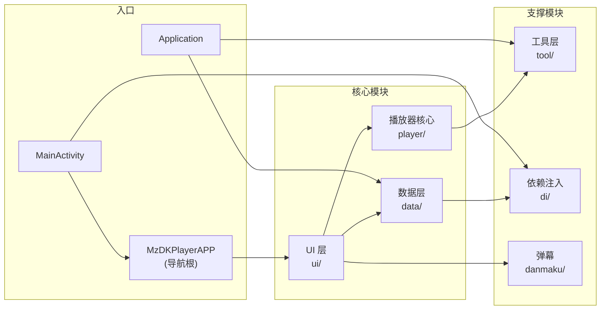
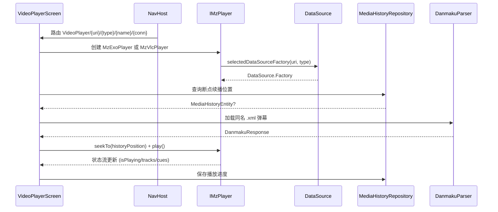
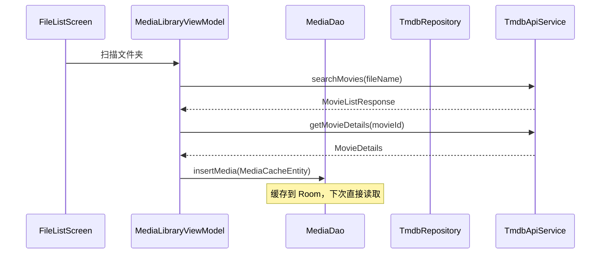

# 03 - 模块设计

## 3.1 模块划分总览



## 3.2 播放器核心模块（`player/`）

### 接口设计

[IMzPlayer.kt](../app/src/main/java/org/mz/mzdkplayer/player/core/IMzPlayer.kt) 定义了播放器的统一抽象：

```kotlin
interface IMzPlayer {
    // 状态流
    val isPlayingFlow: StateFlow<Boolean>
    val playerStatus: StateFlow<VideoPlayerStatus>
    val videoTracks: StateFlow<List<MzVideoTrack>>
    val audioTracks: StateFlow<List<MzBasicTrack>>
    val subtitleTracks: StateFlow<List<MzBasicTrack>>

    // 视频尺寸（用于字幕定位）
    val videoWidth: Int
    val videoHeight: Int

    // 播放控制
    fun play()
    fun pause()
    fun seekTo(positionMs: Long)
    fun seekForward(ms: Long = 30000)
    fun seekBack(ms: Long = 30000)

    // 轨道切换
    fun selectVideoTrack(track: MzVideoTrack)
    fun selectAudioTrack(track: MzBasicTrack)
    fun selectSubtitleTrack(track: MzBasicTrack)

    // 字幕
    var onCuesChanged: ((Any) -> Unit)?
    fun addExternalSubtitles(subtitles: List<Pair<String, String>>)

    // ISO 蓝光标题
    val isoTitles: StateFlow<List<MzIsoTitle>>
    fun selectIsoTitle(index: Int)

    // 错误回调
    var onError: ((String) -> Unit)?

    // Compose 渲染入口
    @Composable
    fun PlayerView(modifier: Modifier)

    fun release()
}
```

### 双实现

| 实现 | 文件 | 引擎 | 适用场景 |
|------|------|------|---------|
| MzExoPlayer | [player/exo/MzExoPlayer.kt](../app/src/main/java/org/mz/mzdkplayer/player/exo/MzExoPlayer.kt) | Media3/ExoPlayer | 默认引擎，通用视频 |
| MzVlcPlayer | [player/vlc/MzVlcPlayer.kt](../app/src/main/java/org/mz/mzdkplayer/player/vlc/MzVlcPlayer.kt) | libvlc | ISO 蓝光原盘、m2ts/ts 格式、音频直通 |

### 引擎选择逻辑

在 [MzDKPlayerAPP.kt:407-410](../app/src/main/java/org/mz/mzdkplayer/ui/MzDKPlayerAPP.kt#L407)：

```kotlin
val extension = decodedUri.substringAfterLast('.').lowercase()
val forceVlcByExtension = extension in listOf("m2ts", "iso", "m2t", "mts", "ts")
val shouldUseVlc = forceVlcByExtension || (settingsState.defaultPlayer == "vlc")
```

### 轨道模型（[MzTrackModels.kt](../app/src/main/java/org/mz/mzdkplayer/player/core/MzTrackModels.kt)）

- `MzVideoTrack` - 视频轨（含分辨率、编码信息）
- `MzBasicTrack` - 音轨/字幕轨（含语言、名称）
- `MzIsoTitle` - ISO 蓝光标题（index、名称、时长）

### 字幕自动加载

[IMzPlayer.kt:56](../app/src/main/java/org/mz/mzdkplayer/player/core/IMzPlayer.kt#L56) 的 `autoLoadSameNameSubtitles()` 函数：
- 提取视频文件名（去扩展名）
- 尝试匹配同名 `.ass` / `.srt` / `.ssa` / `.vtt` 字幕
- 本地文件检查存在性，网络协议直接尝试加载

## 3.3 数据层模块（`data/`）

### 目录结构

```
data/
├── api/                    # Retrofit API
│   ├── TmdbApiService.kt   # TMDB 接口定义
│   └── TmdbServiceCreator.kt  # Retrofit 创建器
├── local/                  # Room 本地存储
│   ├── AppDatabase.kt      # 数据库 + 迁移
│   ├── *Entity.kt          # 5 个实体
│   ├── *Dao.kt             # 5 个 DAO
│   └── MediaConverters.kt  # Room 类型转换器
├── model/                  # 数据模型
│   ├── Movie.kt / MovieDetails.kt
│   ├── TVData.kt / TVSeriesDetails.kt / TVEpisode.kt
│   ├── *Connection.kt      # 各协议连接配置
│   ├── MediaItem.kt / AudioItem.kt
│   └── DanmakuSettings.kt 等
└── repository/             # Repository 层
    ├── TmdbRepository.kt
    ├── RoomMediaHistoryRepository.kt
    ├── *ConnectionRepository.kt  # 5 个连接 Repository
    ├── HomeSlotRepository.kt
    ├── FolderVideoRepository.kt
    ├── SettingsRepository.kt
    ├── ModeManager.kt
    ├── ElderModeConfig.kt
    ├── ThumbnailManager.kt
    └── Resource.kt          # 统一结果封装
```

### Repository 职责

| Repository | 数据源 | 职责 |
|-----------|--------|------|
| TmdbRepository | TMDB API | 电影/电视剧搜索与详情 |
| RoomMediaHistoryRepository | Room | 播放历史 CRUD |
| SMBConnectionRepository | SharedPreferences | SMB 连接配置 |
| FTPConnectionRepository | SharedPreferences | FTP 连接配置 |
| NFSConnectionRepository | SharedPreferences | NFS 连接配置 |
| WebDavConnectionRepository | SharedPreferences | WebDAV 连接配置 |
| HTTPLinkConnectionRepository | SharedPreferences | HTTP 连接配置 |
| HomeSlotRepository | Room | 老人模式栏位管理、`cleanupUninstalledAppSlots()` 清理失效 App 栏位 |
| FolderVideoRepository | Room | 文件夹视频管理 |
| ThumbnailManager | 文件系统 | 缩略图提取与缓存 |

### 统一结果封装（[Resource.kt](../app/src/main/java/org/mz/mzdkplayer/data/repository/Resource.kt)）

```kotlin
sealed class Resource<out T> {
    data class Success<T>(val data: T) : Resource<T>()
    data class Error(val message: String, val exception: Exception? = null) : Resource<Nothing>()
    object Loading : Resource<Nothing>()
}
```

所有 TMDB API 调用通过 `TmdbRepository.safeApiCall` 统一包装，返回 `Resource<T>`。

## 3.4 UI 层模块（`ui/`）

### 目录结构

```
ui/
├── MzDKPlayerAPP.kt        # 根 Composable + NavHost
├── videoplayer/            # 视频播放
│   ├── VideoPlayerScreen.kt     # 主播放界面 (1037 行)
│   └── components/               # 播放器组件
├── audioplayer/            # 音频播放
│   ├── AudioPlayerScreen.kt
│   └── components/
├── picviewer/              # 图片查看
├── elder/                  # 老人模式
│   ├── ElderTheme.kt            # 统一 UI 主题（配色/尺寸常量 + ElderButton/ElderTopBarButton 组件）
│   ├── ElderHomeScreen.kt       # 首页（栏位网格 + SlotConfigDialog + PinDialog + ElderTopBar）
│   ├── ElderAppListScreen.kt    # 应用列表页（网格展示所有 App + 包变更监听）
│   ├── ElderFolderScreen.kt     # 文件夹视频列表（并行加载缩略图）
│   └── ElderPlayerOverlay.kt    # 简化播放器控制栏（进度条支持点击跳转）
├── screen/                # 标准模式各页面
│   ├── home/              # 文件浏览首页
│   ├── library/           # 媒体库（电影/电视/音乐）
│   ├── movie/             # 电影详情
│   ├── tv/                # 电视剧详情
│   ├── smbfile/           # SMB 连接与文件
│   ├── ftp/               # FTP 连接与文件
│   ├── nfs/               # NFS 连接与文件
│   ├── webdavfile/        # WebDAV 连接与文件
│   ├── httplink/          # HTTP 连接与文件
│   ├── localfile/          # 本地文件
│   ├── search/            # 搜索
│   ├── history/           # 历史记录
│   ├── setting/           # 设置
│   └── vm/                # ViewModel 集合
└── theme/                 # 主题
```

### ViewModel 清单

| ViewModel | 职责 | 创建方式 |
|-----------|------|---------|
| MediaLibraryViewModel | 媒体库分页数据 | `RepositoryProvider.createMediaLibraryViewModel()` |
| MovieViewModel | 电影详情 | `RepositoryProvider.createMovieViewModel()` |
| AudioViewModel | 音频库 | `RepositoryProvider.createAudioViewModel()` |
| MediaHistoryViewModel | 播放历史 | `RepositoryProvider.createMediaHistoryViewModel()` |
| SearchViewModel | 搜索 | `RepositoryProvider.createSearchViewModel()` |
| SettingsViewModel | 设置（MutableStateFlow + update） | `viewModel()` |
| SMBListViewModel | SMB 连接列表 | `viewModel()` |
| SmbScanViewModel | SMB 局域网扫描状态 + 智能排序 | `viewModel()` |
| FTPListViewModel | FTP 连接列表 | `viewModel()` |
| NFSListViewModel | NFS 连接列表 | `viewModel()` |
| WebDavListViewModel | WebDAV 连接列表 | `viewModel()` |
| HTTPLinkListViewModel | HTTP 连接列表 | `viewModel()` |

## 3.5 工具层模块（`tool/`）

### DataSource 工厂

各协议的 ExoPlayer `DataSource.Factory` 实现，用于让 ExoPlayer 读取非 HTTP 协议的媒体：

| 文件 | 协议 | 关键类 |
|------|------|--------|
| [SMBDataSource.kt](../app/src/main/java/org/mz/mzdkplayer/tool/SMBDataSource.kt) | SMB | `SmbDataSource` / `SmbDataSourceFactory` / `SmbDataSourceConfig` |
| [FTPDataSource.kt](../app/src/main/java/org/mz/mzdkplayer/tool/FTPDataSource.kt) | FTP | `FtpDataSource` / `FtpDataSourceFactory` |
| [NFSDataSource.kt](../app/src/main/java/org/mz/mzdkplayer/tool/NFSDataSource.kt) | NFS | `NfsDataSource` |
| [WebDavDataSource.kt](../app/src/main/java/org/mz/mzdkplayer/tool/WebDavDataSource.kt) | WebDAV | `WebDavDataSource` |
| [FileMediaInfo.kt](../app/src/main/java/org/mz/mzdkplayer/tool/FileMediaInfo.kt) | 统一工厂 | `builderPlayer()` / `setupPlayer()` |

### 静态资源管理

⚠️ SMB/FTP/WebDAV 三个 DataSource 都在 `companion object` 持有静态连接缓存，并提供 `releaseGlobalResources()` 静态方法。播放页退出时需手动调用 3 个静态方法释放，否则会泄漏 socket。

### HTTP 服务器

| 类 | 端口 | 用途 |
|----|------|------|
| [WebConfigServer.kt](../app/src/main/java/org/mz/mzdkplayer/tool/WebConfigServer.kt) | 18080 | 老人模式 Web 配置页面（REST API + 静态 HTML） |
| [RemoteInputServer.kt](../app/src/main/java/org/mz/mzdkplayer/tool/RemoteInputServer.kt) | 动态 | 手机端远程输入 SMB 配置 |

### 其他工具类

| 文件 | 职责 |
|------|------|
| [SmbDiscoveryScanner.kt](../app/src/main/java/org/mz/mzdkplayer/tool/SmbDiscoveryScanner.kt) | 局域网 SMB 服务自动发现（mDNS + 子网端口扫描 + Guest 认证探测） |
| [SmbConnectionManager.kt](../app/src/main/java/org/mz/mzdkplayer/tool/SmbConnectionManager.kt) | 全局 SMB 连接管理单例（连接复用 + 指数退避自动重连 + 后台健康巡检） |
| [Tools.kt](../app/src/main/java/org/mz/mzdkplayer/tool/Tools.kt) | 通用工具（时间格式化、URL 编码、字体准备等，853 行） |
| [AppLauncherHelper.kt](../app/src/main/java/org/mz/mzdkplayer/tool/AppLauncherHelper.kt) | 查询已安装 App、启动 App（老人模式栏位）、`drawableToImageBitmap()` 支持任意 Drawable 转 ImageBitmap |
| [ThumbnailManager.kt](../app/src/main/java/org/mz/mzdkplayer/data/repository/ThumbnailManager.kt) | 缩略图提取（MediaMetadataRetriever）与缓存 |
| [CustomSubtitleView.kt](../app/src/main/java/org/mz/mzdkplayer/tool/CustomSubtitleView.kt) | 自定义字幕渲染视图 |
| [ColorExtractor.kt](../app/src/main/java/org/mz/mzdkplayer/tool/ColorExtractor.kt) | 从图片提取主色调 |
| [LanguageManager.kt](../app/src/main/java/org/mz/mzdkplayer/tool/LanguageManager.kt) | 应用语言切换 |
| [AudioNameParser.kt](../app/src/main/java/org/mz/mzdkplayer/tool/AudioNameParser.kt) | 从文件名解析音频信息 |
| [ReadFlacHeader.kt](../app/src/main/java/org/mz/mzdkplayer/tool/ReadFlacHeader.kt) | 读取 FLAC 文件头信息 |

## 3.6 弹幕模块（`danmaku/`）

| 文件 | 职责 |
|------|------|
| [DanmakuParser.kt](../app/src/main/java/org/mz/mzdkplayer/danmaku/DanmakuParser.kt) | 解析 B 站 XML 弹幕文件 |
| [DanmakuResponse.kt](../app/src/main/java/org/mz/mzdkplayer/danmaku/DanmakuResponse.kt) | 弹幕数据模型 |

弹幕渲染使用快手开源的 **AKDanmaku** 库（本地 AAR），在 [VideoPlayerScreen.kt](../app/src/main/java/org/mz/mzdkplayer/ui/videoplayer/VideoPlayerScreen.kt) 中集成 `DanmakuPlayer` 组件。

## 3.7 模块间交互关系

### 播放流程交互



### TMDB 刮削交互


