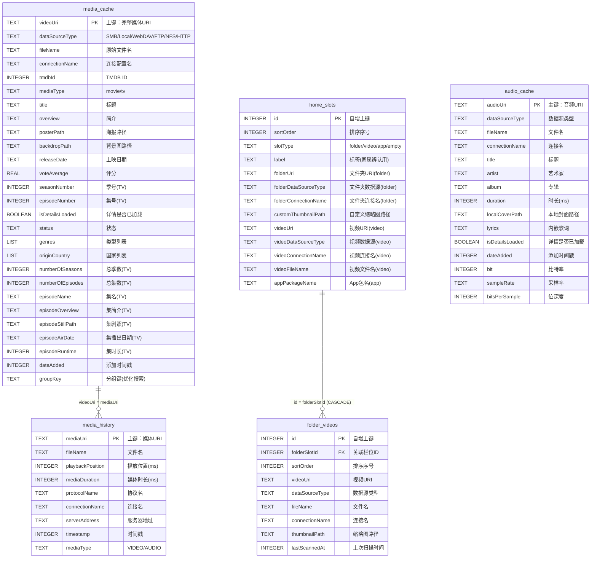

# 04 - 数据库设计

## 4.1 数据库概览

- **数据库**：Room（SQLite 封装）
- **数据库名**：`mzdk_player_database`
- **当前版本**：9
- **实体数量**：5
- **DAO 数量**：5
- **迁移策略**：显式迁移（`addMigrations`），无 `fallbackToDestructiveMigration`

## 4.2 ER 图



## 4.3 表结构详解

### 4.3.1 media_cache（媒体缓存表）

**用途**：缓存 TMDB 刮削的影视元数据，避免重复请求 API。

**文件**：[MediaCacheEntity.kt](../app/src/main/java/org/mz/mzdkplayer/data/local/MediaCacheEntity.kt)

| 字段 | 类型 | 说明 |
|------|------|------|
| videoUri | TEXT (PK) | 完整媒体 URI，主键 |
| dataSourceType | TEXT | 数据源类型：`SMB`/`Local`/`WebDAV`/`FTP`/`NFS`/`HTTP` |
| fileName | TEXT | 原始文件名 |
| connectionName | TEXT | 连接配置名 |
| tmdbId | INTEGER | TMDB ID |
| mediaType | TEXT | `movie` 或 `tv` |
| title | TEXT | 标题 |
| overview | TEXT | 简介 |
| posterPath | TEXT? | 海报路径 |
| backdropPath | TEXT? | 背景图路径 |
| releaseDate | TEXT? | 上映日期 |
| voteAverage | REAL | 评分 |
| seasonNumber | INTEGER | 季号（TV，默认 0） |
| episodeNumber | INTEGER | 集号（TV，默认 0） |
| isDetailsLoaded | BOOLEAN | 详情是否已加载 |
| status | TEXT | 状态 |
| genres | LIST | 类型列表（TypeConverter） |
| originCountry | LIST | 国家列表（TypeConverter） |
| numberOfSeasons | INTEGER? | 总季数（TV） |
| numberOfEpisodes | INTEGER? | 总集数（TV） |
| episodeName | TEXT? | 集名（TV 单集） |
| episodeOverview | TEXT? | 集简介 |
| episodeStillPath | TEXT? | 集剧照 |
| episodeAirDate | TEXT? | 集播出日期 |
| episodeRuntime | INTEGER? | 集时长 |
| dateAdded | INTEGER | 添加时间戳 |
| groupKey | TEXT | 分组键（优化搜索分组） |

**索引**：
- `index_media_cache_groupKey` - 加速分组查询
- `index_media_cache_title` - 加速排序
- `index_media_cache_tmdbId` - 加速关联查询

**DAO**：[MediaDao.kt](../app/src/main/java/org/mz/mzdkplayer/data/local/MediaDao.kt)
- `getMoviesPaged()` - 电影分页（按 tmdbId 分组）
- `getTVSeriesPaged()` - 电视剧分页（按 tmdbId 分组）
- `getEpisodesForSeries(tmdbId)` - 获取某剧所有集
- `searchMediaPaged(query)` - 模糊搜索（用 groupKey 分组优化）
- `getMovieVersions(tmdbId)` - 获取某电影所有版本

### 4.3.2 media_history（播放历史表）

**用途**：记录音视频播放进度，支持断点续播。

**文件**：[MediaHistoryEntity.kt](../app/src/main/java/org/mz/mzdkplayer/data/local/MediaHistoryEntity.kt)

| 字段 | 类型 | 说明 |
|------|------|------|
| mediaUri | TEXT (PK) | 媒体 URI，主键 |
| fileName | TEXT | 文件名 |
| playbackPosition | INTEGER | 播放位置（ms） |
| mediaDuration | INTEGER | 媒体时长（ms） |
| protocolName | TEXT | 协议名 |
| connectionName | TEXT | 连接名 |
| serverAddress | TEXT | 服务器地址 |
| timestamp | INTEGER | 时间戳 |
| mediaType | TEXT | `VIDEO` 或 `AUDIO` |

**辅助方法**：`getPlaybackPercentage()` 返回 0-100 的播放百分比。

**DAO**：[MediaHistoryDao.kt](../app/src/main/java/org/mz/mzdkplayer/data/local/MediaHistoryDao.kt)
- `getVideoHistoryWithMetadata()` - 关联 media_cache 获取带元数据的历史（`@Transaction`）
- `getVideoHistoryPagingSource()` - 视频历史分页
- `getHistoryByUri(uri)` - 断点续播查询

### 4.3.3 audio_cache（音频缓存表）

**用途**：缓存音频元数据（标题/艺术家/专辑/歌词/封面）。

**文件**：[AudioCacheEntity.kt](../app/src/main/java/org/mz/mzdkplayer/data/local/AudioCacheEntity.kt)

| 字段 | 类型 | 说明 |
|------|------|------|
| audioUri | TEXT (PK) | 音频 URI，主键 |
| dataSourceType | TEXT | 数据源类型 |
| fileName | TEXT | 文件名 |
| connectionName | TEXT | 连接名 |
| title | TEXT | 标题 |
| artist | TEXT | 艺术家 |
| album | TEXT | 专辑 |
| duration | INTEGER | 时长（ms） |
| localCoverPath | TEXT? | 本地封面路径 |
| lyrics | TEXT? | 内嵌歌词 |
| isDetailsLoaded | BOOLEAN | 详情是否已加载 |
| dateAdded | INTEGER | 添加时间戳 |
| bit | INTEGER | 比特率 |
| sampleRate | TEXT | 采样率 |
| bitsPerSample | INTEGER | 位深度（默认 16） |

**索引**：`title` / `album` / `artist` / `dateAdded`

### 4.3.4 home_slots（老人模式栏位表）

**用途**：老人模式首页的栏位配置。

**文件**：[HomeSlotEntity.kt](../app/src/main/java/org/mz/mzdkplayer/data/local/HomeSlotEntity.kt)

| 字段 | 类型 | 说明 |
|------|------|------|
| id | INTEGER (PK, autoGen) | 自增主键 |
| sortOrder | INTEGER | 排序序号（0-based） |
| slotType | TEXT | `folder`/`video`/`app`/`empty` |
| label | TEXT | 标签（家属辨认，老人模式不显示） |
| folderUri | TEXT? | 文件夹 URI（folder 类型） |
| folderDataSourceType | TEXT? | 文件夹数据源（`SMB`/`FILE`） |
| folderConnectionName | TEXT? | 文件夹连接名 |
| customThumbnailPath | TEXT? | 自定义缩略图路径 |
| videoUri | TEXT? | 视频 URI（video 类型） |
| videoDataSourceType | TEXT? | 视频数据源 |
| videoConnectionName | TEXT? | 视频连接名 |
| videoFileName | TEXT? | 视频文件名 |
| appPackageName | TEXT? | App 包名（app 类型） |

### 4.3.5 folder_videos（文件夹视频表）

**用途**：老人模式文件夹栏位内的视频列表。

**文件**：[FolderVideoEntity.kt](../app/src/main/java/org/mz/mzdkplayer/data/local/FolderVideoEntity.kt)

| 字段 | 类型 | 说明 |
|------|------|------|
| id | INTEGER (PK, autoGen) | 自增主键 |
| folderSlotId | INTEGER (FK) | 关联 home_slots.id |
| sortOrder | INTEGER | 文件夹内排序 |
| videoUri | TEXT | 视频 URI |
| dataSourceType | TEXT | 数据源类型 |
| fileName | TEXT | 文件名 |
| connectionName | TEXT | 连接名 |
| thumbnailPath | TEXT? | 缩略图路径 |
| lastScannedAt | INTEGER | 上次扫描时间 |

**外键**：`folderSlotId` → `home_slots.id`，`ON DELETE CASCADE`（删除栏位时级联删除视频）

**索引**：`index_folder_videos_folderSlotId`

## 4.4 类型转换器

[MediaConverters.kt](../app/src/main/java/org/mz/mzdkplayer/data/local/MediaConverters.kt) 处理 Room 不支持的复杂类型：

- `List<Genre>` ↔ JSON String
- `List<String>` ↔ JSON String

## 4.5 数据库迁移历史

| 版本 | 变更 | 说明 |
|------|------|------|
| V1 → V2 | media_cache 新增 `dataSourceType`/`fileName`/`connectionName` | 支持多协议 |
| V2 → V3 | 创建 `media_history` 表 | 播放历史 |
| V3 → V4 | media_cache 新增 `groupKey` + 3 个索引 | 优化搜索分组 |
| V4 → V5 | 创建 `audio_cache` 表 + 2 个索引 | 音频库 |
| V5 → V6 | media_cache 新增 `dateAdded`；audio_cache 新增 `isDetailsLoaded` | 时间排序 |
| V6 → V7 | audio_cache 新增 `bit`/`sampleRate`/`bitsPerSample` | 音频详情 |
| V7 → V8 | audio_cache 新增 `title`/`dateAdded` 索引 | 加速排序 |
| V8 → V9 | 创建 `home_slots` + `folder_videos` 表 | 老人模式 |

### 迁移编写规范

新增表/字段时，必须在 [AppDatabase.kt](../app/src/main/java/org/mz/mzdkplayer/data/local/AppDatabase.kt) 中：

1. 新增 `MIGRATION_X_Y` 常量
2. 在 `@Database` 注解更新 `version`
3. 在 `getDatabase()` 的 `addMigrations()` 中添加新迁移
4. 新增字段必须提供 `DEFAULT` 值

```kotlin
val MIGRATION_9_10: Migration = object : Migration(9, 10) {
    override fun migrate(db: SupportSQLiteDatabase) {
        db.execSQL("ALTER TABLE media_cache ADD COLUMN newField TEXT NOT NULL DEFAULT ''")
    }
}
```

## 4.6 数据库访问模式

### 单例获取

```kotlin
AppDatabase.getDatabase(context)  // 双重检查锁单例
```

### Repository 封装

数据访问通过 Repository 封装，UI 层不直接操作 DAO：

- `RoomMediaHistoryRepository` → `mediaHistoryDao`
- `HomeSlotRepository` → `homeSlotDao`（object 单例）
- `FolderVideoRepository` → `folderVideoDao`

### 连接配置存储

⚠️ 5 个协议连接配置（SMB/FTP/NFS/WebDAV/HTTP）**不使用 Room**，而是各自用独立的 SharedPreferences + Gson 序列化：

```kotlin
// SMBConnectionRepository 示例
prefs = context.getSharedPreferences("smb_connections_prefs", MODE_PRIVATE)
prefs.edit { putString("connections", gson.toJson(connections)) }
```

这是历史遗留设计，导致 5 套 Repository 代码高度重复。
