# 06 - 关键业务流程

## 6.1 视频播放流程

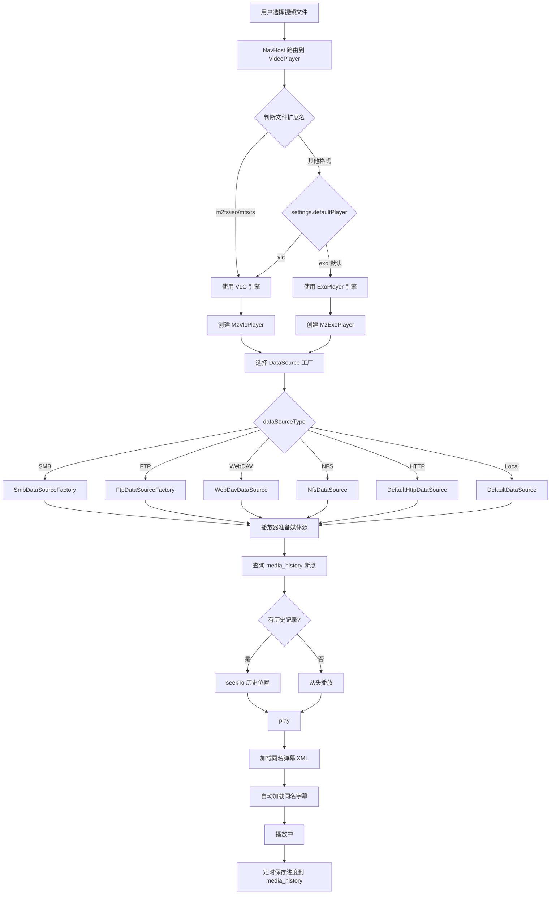

### 关键代码位置

| 步骤 | 文件 | 行 |
|------|------|-----|
| 路由参数解析 | [MzDKPlayerAPP.kt](../app/src/main/java/org/mz/mzdkplayer/ui/MzDKPlayerAPP.kt) | 392-421 |
| 引擎选择 | MzDKPlayerAPP.kt | 407-410 |
| 播放器创建 | [VideoPlayerScreen.kt](../app/src/main/java/org/mz/mzdkplayer/ui/videoplayer/VideoPlayerScreen.kt) | - |
| DataSource 工厂 | [FileMediaInfo.kt](../app/src/main/java/org/mz/mzdkplayer/tool/FileMediaInfo.kt) `builderPlayer()` | 198 |
| 历史查询 | MediaHistoryDao `getHistoryByUri()` | - |

## 6.2 弹幕加载与渲染流程

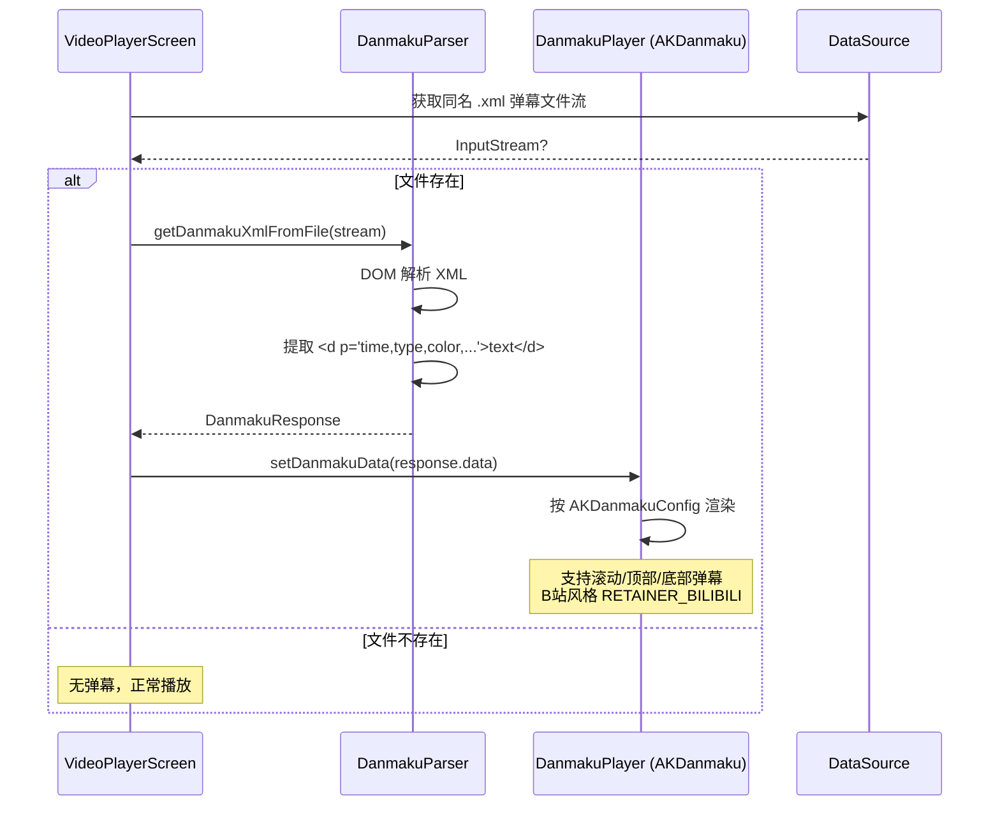

### 弹幕文件匹配规则

- 视频文件名去扩展名 + `.xml`
- 示例：`video.mkv` → `video.xml`
- 本地文件检查存在性，网络协议直接尝试

### 弹幕配置

[DanmakuSettings.kt](../app/src/main/java/org/mz/mzdkplayer/data/model/DanmakuSettings.kt) + [DanmakuSettingsManager.kt](../app/src/main/java/org/mz/mzdkplayer/data/repository/DanmakuSettingsManager.kt) 管理弹幕样式：
- 字体大小、透明度、速度
- 显示区域比例（[DanmakuScreenRatio.kt](../app/src/main/java/org/mz/mzdkplayer/data/model/DanmakuScreenRatio.kt)）
- 弹幕类型开关（[DanmakuType.kt](../app/src/main/java/org/mz/mzdkplayer/data/model/DanmakuType.kt)）

## 6.3 TMDB 刮削流程

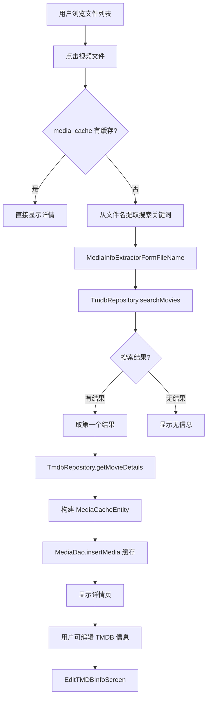

### 文件名解析

[MediaInfoExtractorFormFileName.kt](../app/src/main/java/org/mz/mzdkplayer/tool/MediaInfoExtractorFormFileName.kt) 从文件名提取：
- 标题（去除年份、分辨率、编码等标记）
- 年份
- 季号/集号（电视剧）

### 缓存策略

- 首次刮削后存入 `media_cache` 表
- `isDetailsLoaded` 标记是否已加载完整详情
- `groupKey` 用于搜索时分组（同一 TMDB ID 的不同版本只显示一条）

## 6.4 老人模式首页流程

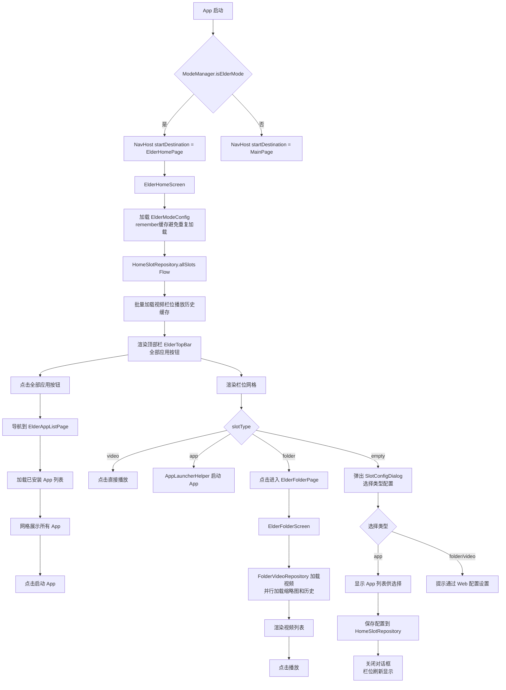

### 空栏位配置流程

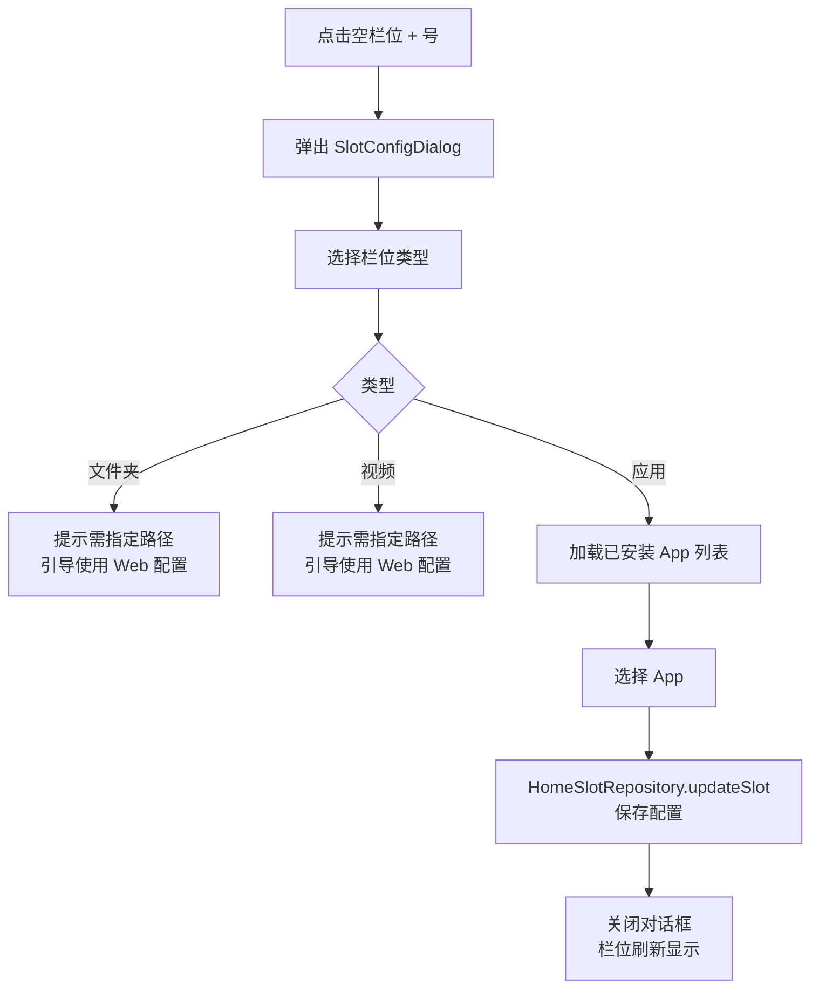

### 应用列表页与包变更监听

[ElderAppListScreen.kt](../app/src/main/java/org/mz/mzdkplayer/ui/elder/ElderAppListScreen.kt) 提供 5 列网格展示所有已安装 App：

| 特性 | 说明 |
|------|------|
| 入口 | 首页顶部"全部应用"按钮 |
| 列表来源 | `AppLauncherHelper.getLaunchableApps()`，排除自身 |
| 图标渲染 | `drawableToImageBitmap()` 支持 AdaptiveIcon/VectorDrawable |
| 点击行为 | 直接启动 App |
| 实时刷新 | `DisposableEffect` 注册 `PACKAGE_ADDED/REMOVED/REPLACED` 广播 |

#### 包变更监听流程

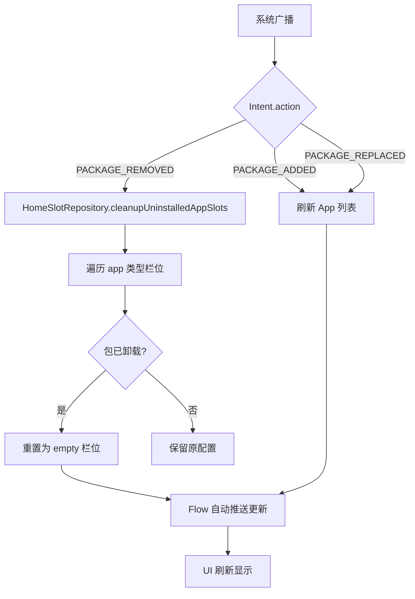

#### 关键代码位置

| 步骤 | 文件 | 行 |
|------|------|-----|
| 广播注册 | [ElderAppListScreen.kt](../app/src/main/java/org/mz/mzdkplayer/ui/elder/ElderAppListScreen.kt) | DisposableEffect |
| 清理失效栏位 | [HomeSlotRepository.kt](../app/src/main/java/org/mz/mzdkplayer/data/repository/HomeSlotRepository.kt) | `cleanupUninstalledAppSlots()` |
| 图标转换 | [AppLauncherHelper.kt](../app/src/main/java/org/mz/mzdkplayer/tool/AppLauncherHelper.kt) | `drawableToImageBitmap()` |

### 返回键行为

老人模式首页返回键采用**双击确认退出**机制：
- 第一次按下：显示"再按一次返回键退出"提示（2秒内有效）
- 第二次按下（2秒内）：退出应用
- 超过2秒：重置状态，需重新双击

### 模式切换流程

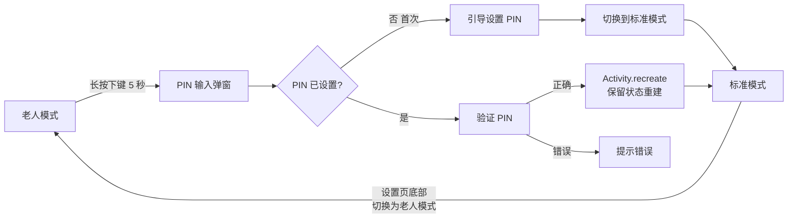

## 6.5 播放历史与断点续播

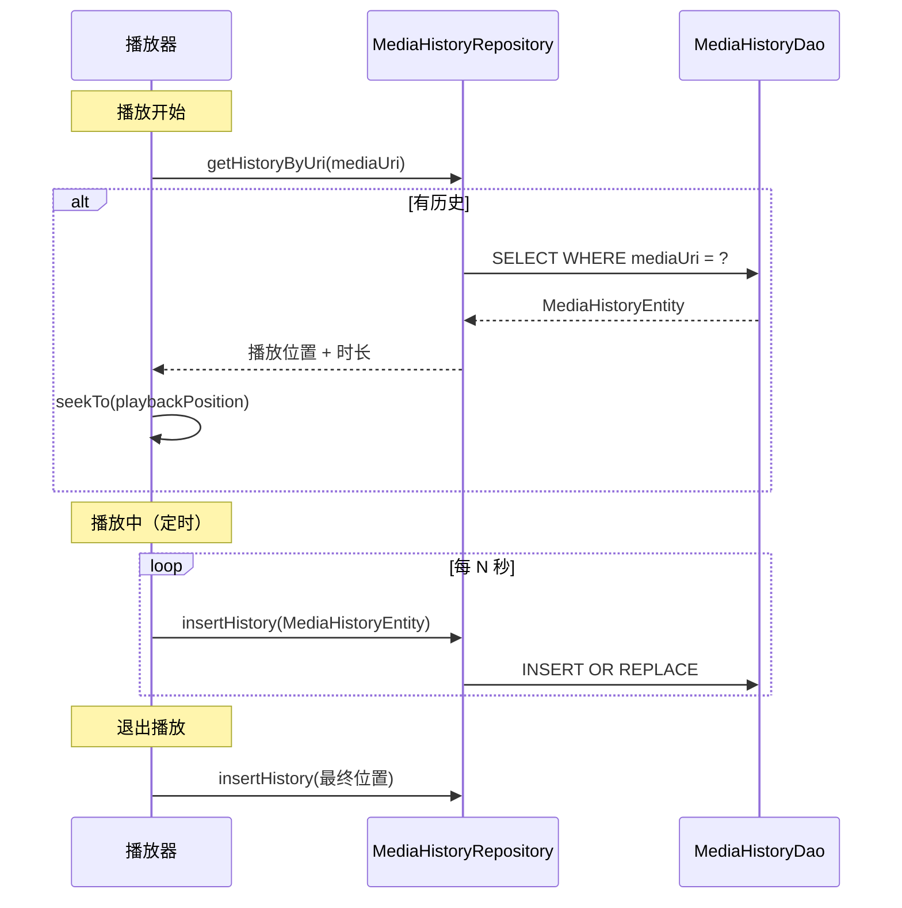

### 老人模式续播差异

| 行为 | 标准模式 | 老人模式 |
|------|---------|---------|
| 续播确认 | 弹窗询问 | 自动续播，无弹窗（`autoResume=true`） |
| 播放结束 | 停留在播放器 | 根据 `stayOnPageAfterEnd` 配置：<br/>- `true`：停留显示控制栏<br/>- `false`：自动返回上一页 |

### 老人模式播放器控制栏

[ElderPlayerOverlay.kt](../app/src/main/java/org/mz/mzdkplayer/ui/elder/ElderPlayerOverlay.kt) 提供简化控制栏：

| 特性 | 说明 |
|------|------|
| 按钮 | 仅 3 个大按钮：后退、播放/暂停、前进 |
| 进度条 | 6dp 加粗进度条，支持点击/拖动跳转 |
| 时间显示 | 大字号（22sp） |
| 高级控制 | 根据配置隐藏弹幕、网速、轨道等按钮 |

进度条交互：
- 点击任意位置跳转到对应时间点
- 拖动实时预览进度，松手后跳转

## 6.6 Web 配置服务流程

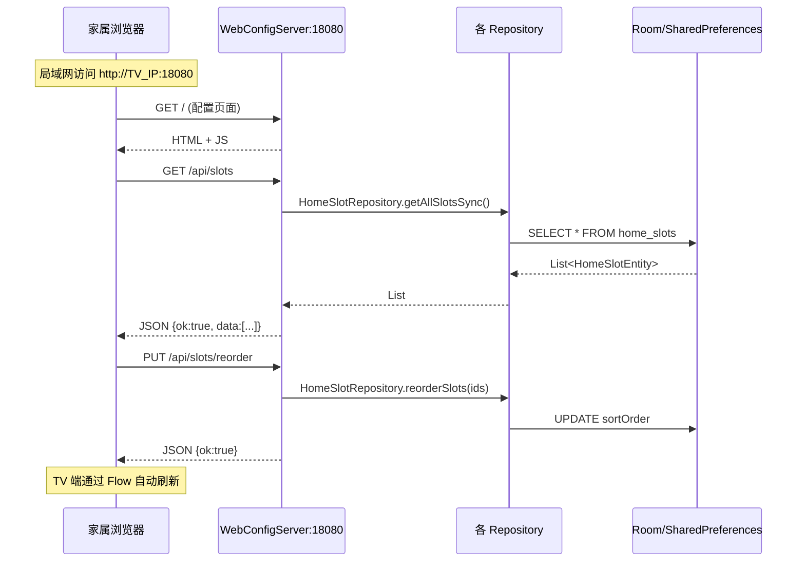

### 启动条件

在 [MainActivity.onCreate](../app/src/main/java/org/mz/mzdkplayer/MainActivity.kt#L103)：

```kotlin
(application as MzDkPlayerApplication).startWebConfigServerIfNeeded()
```

仅当 `SettingsRepository.webConfigEnabled == true` 时启动。

## 6.7 外部视频 Intent 处理

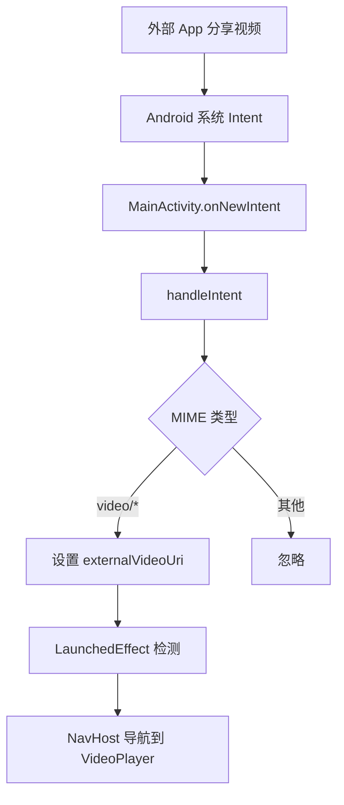

### 支持的 Intent

[AndroidManifest.xml](../app/src/main/AndroidManifest.xml) 声明了两类 intent-filter：

1. **MIME 类型**：`video/*`、`application/x-mpegurl` 等
2. **文件扩展名**：`.mp4`、`.mkv`、`.avi`、`.mov`、`.flv`、`.m3u8`、`.m2ts`

### 已知限制

[MainActivity.kt:117](../app/src/main/java/org/mz/mzdkplayer/MainActivity.kt#L117) 注释指出：`externalVideoUri` 是 Activity 字段，`onNewIntent` 更新后不会触发已初始化的 Compose 重组。对于简单场景（只启动一次播放）已足够。

## 6.8 音频播放流程

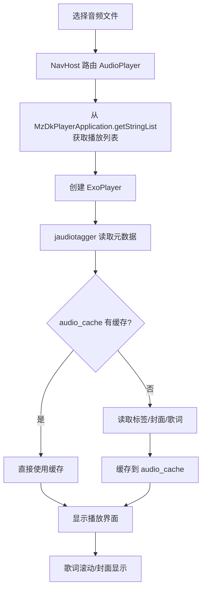

### 播放列表传递

⚠️ 音频播放列表通过 `MzDkPlayerApplication.setStringList("audio_playlist", list)` 全局静态 Map 传递，进程回收后丢失。

## 6.9 SMB 自动扫描与一键连接流程

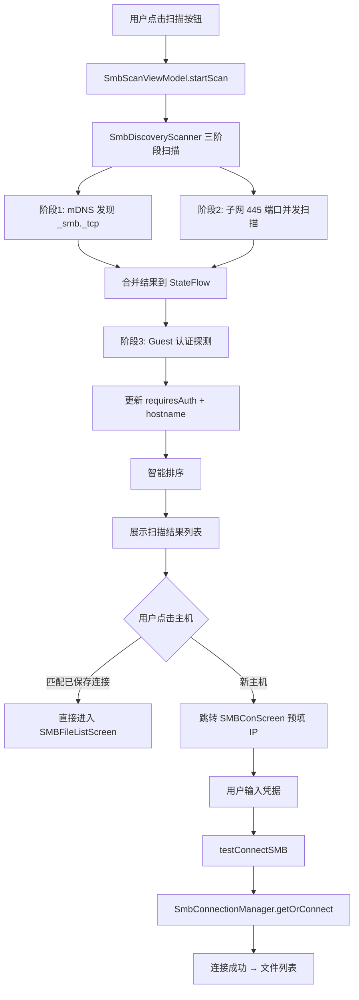

### 三阶段扫描策略

[SmbDiscoveryScanner.kt](../app/src/main/java/org/mz/mzdkplayer/tool/SmbDiscoveryScanner.kt) 采用三阶段策略，结果通过 `StateFlow` 增量推送：

| 阶段 | 方法 | 说明 | 超时 |
|------|------|------|------|
| 1. mDNS 发现 | `discoverViaMdns()` | NsdManager 搜索 `_smb._tcp`，快速但非所有 SMB 服务都注册 | 3s |
| 2. 子网端口扫描 | `scanSubnetPort()` | 并发扫描 254 个 IP 的 445 端口，全面覆盖 | 800ms/IP |
| 3. Guest 认证探测 | `probeSmbAuth()` | 尝试 guest 认证，判断是否需要密码 | 3s/主机 |

阶段 1 和 2 并行执行，阶段 3 在前两阶段完成后对发现的主机并发探测。

### 智能排序策略

[SmbScanViewModel.kt](../app/src/main/java/org/mz/mzdkplayer/ui/screen/vm/SmbScanViewModel.kt) 的 `getSortedHosts()` 按以下优先级排序：

1. **已保存连接优先** — 匹配 `SMBConnectionRepository` 中的记录
2. **免认证优先** — `requiresAuth == false` 的主机排前
3. **响应时间短优先** — `responseTimeMs` 升序
4. **名称排序** — hostname 字母序兜底

### 一键连接逻辑

[SMBConListScreen.kt](../app/src/main/java/org/mz/mzdkplayer/ui/screen/smbfile/SMBConListScreen.kt) 中点击发现的主机：

| 场景 | 行为 |
|------|------|
| 匹配已保存连接 | 直接导航到 `SMBFileListScreen`，URI 含账号密码 |
| 新主机 | 导航到 `SMBConScreen?ip={ip}`，预填 IP，用户手动输入凭据 |

### 全局连接管理与自动重连

[SmbConnectionManager.kt](../app/src/main/java/org/mz/mzdkplayer/tool/SmbConnectionManager.kt) 是单例，`SMBConViewModel` 的连接管理已委托给它：

| 能力 | 说明 |
|------|------|
| 连接复用 | `getOrConnect(id, ...)` 按 `host:shareName` 复用已有连接 |
| 指数退避重连 | 1s → 2s → 4s → 8s → 16s，最多 5 次 |
| 后台健康巡检 | 每 30s 检查空闲连接（空闲 >60s 时触发），通过 `share.list("\\")` 探活 |
| 状态推送 | `StateFlow<Map<String, ConnectionState>>` 供 UI 观察 |

`SMBConViewModel` 的 `connectToSMB` / `testConnectSMB` 调用 `getOrConnect()`，`disconnectSMB` 调用 `disconnect()`，`isConnected()` 查询 `getState()`。`listSMBFiles` 在 share 为 null 时自动通过 Manager 重连。
